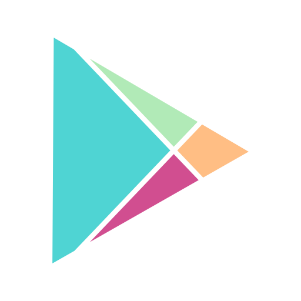
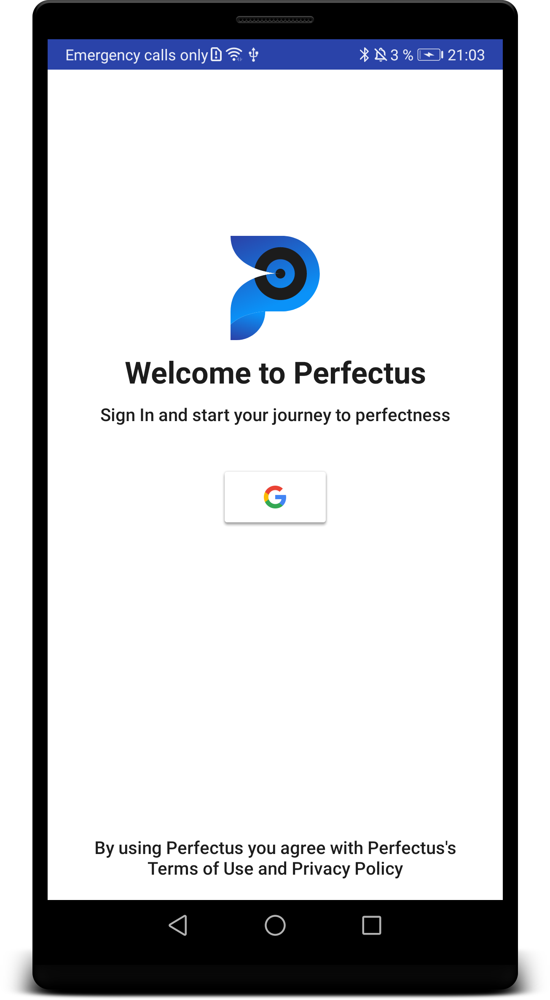
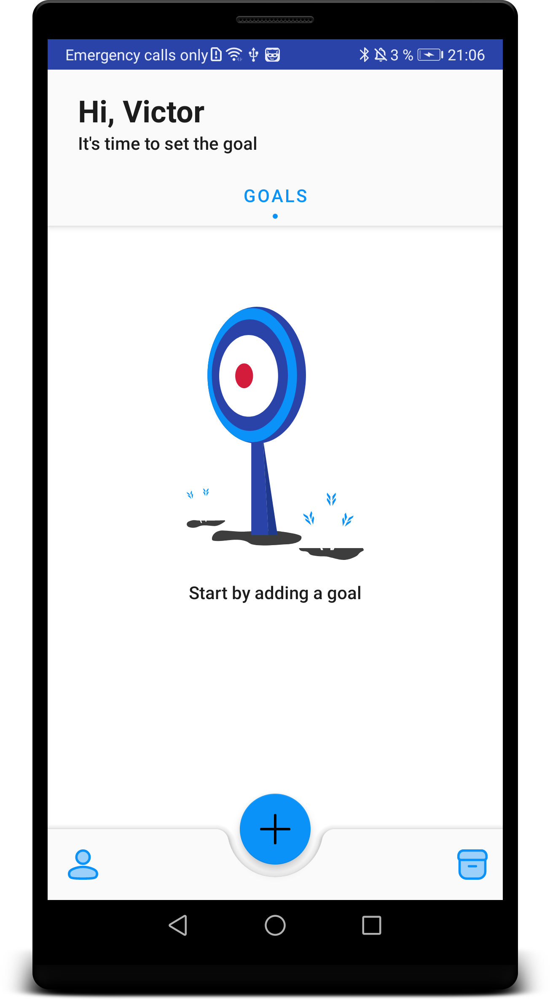
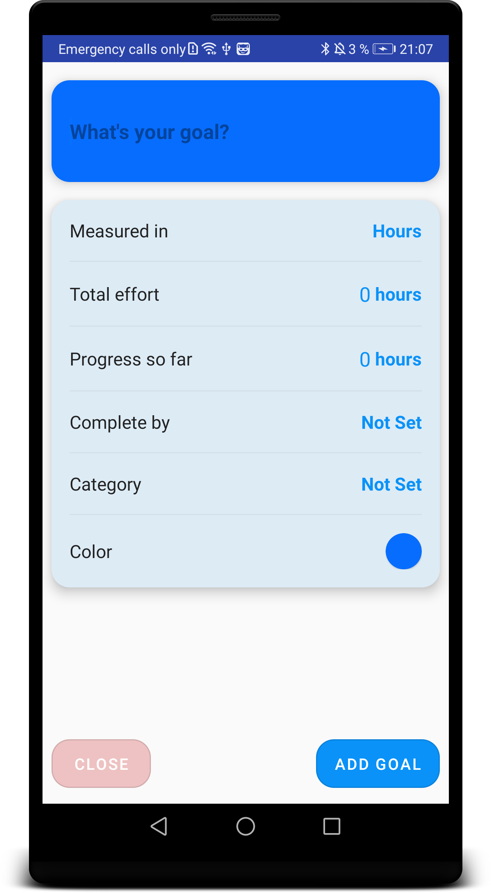
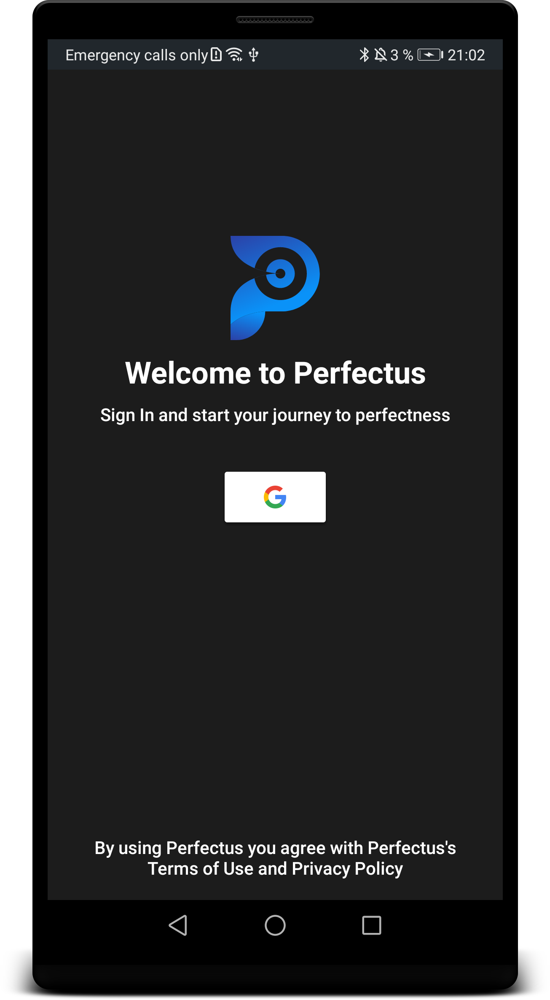
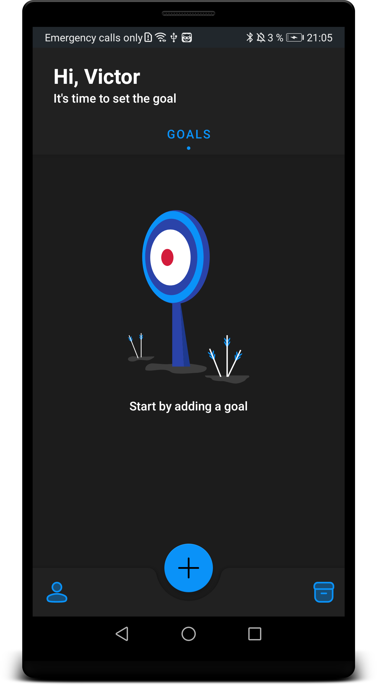
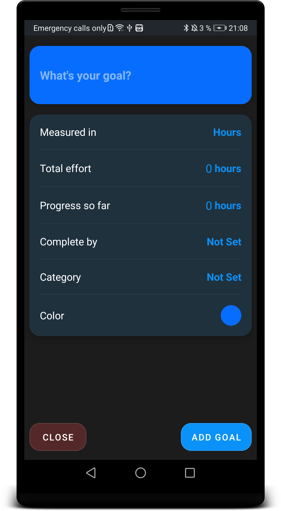

<a href="https://play.google.com/apps/testing/app.chamich.perfectus" target="_blank">
  
</a>

<a href="https://play.google.com/apps/testing/app.chamich.perfectus" target="_blank">
  
</a>


# Perfectus

> “Le mieux est l'ennemi du bien.

[](https://circleci.com/gh/ChamichApps/Perfectus/tree/release)
[](https://www.codacy.com/gh/ChamichApps/Perfectus/dashboard?utm_source=github.com&amp;utm_medium=referral&amp;utm_content=ChamichApps/Perfectus&amp;utm_campaign=Badge_Grade)
[](http://kotlinlang.org/)
[](https://lv.binarybabel.org/catalog/gradle/latest)
[](https://android-arsenal.com/api?level=21)
[](http://www.apache.org/licenses/LICENSE-2.0)

Perfectus is an open-source application running on Android. With the help of Perfectus, you can manage your daily, monthly, and yearly goals, keep track of the progress and share your goals with your friends.

## Table of Contents

-   [Authors](https://github.com/ChamichApps/Perfectus#authors)
-   [License](https://github.com/ChamichApps/Perfectus#license)
-   [Structure](https://github.com/ChamichApps/Perfectus#structure)
-   [Architecture](https://github.com/ChamichApps/Perfectus#architecture)
-   [Design](https://github.com/ChamichApps/Perfectus#design)

## Structure

The project consists of feature and library modules

```
- app
- features
  | - goals
  | - profile
- libraries
  | - authenticator
  | - core
  | - database
  | - design
  | - logger
  | - preferences
```
## Architecture

## Design


| Theme  | Sign In  | Empty Goals  | Add Goal  |
|-------|-----------|--------|-----------|
| Light ||||
| Dark  ||||

## Author

<a href="https://medium.com/@vapoyan" target="_blank">
  
</a>

**Viktor Apoyan**

[](https://www.linkedin.com/in/victorapoyan/)
[](https://twitter.com/ApoyanViktor)
[](https://stackoverflow.com/users/612606/viktor-apoyan)
[](https://medium.com/@vapoyan)

## License

```license
 Copyright (c) 2020 Chamich Apps.
 
 Licensed under the Apache License, Version 2.0 (the "License");
 you may not use this file except in compliance with the License.
 You may obtain a copy of the License at
 
       http://www.apache.org/licenses/LICENSE-2.0
 
 Unless required by applicable law or agreed to in writing, software
 distributed under the License is distributed on an "AS IS" BASIS,
 WITHOUT WARRANTIES OR CONDITIONS OF ANY KIND, either express or implied.
 See the License for the specific language governing permissions and
 limitations under the License.
```
